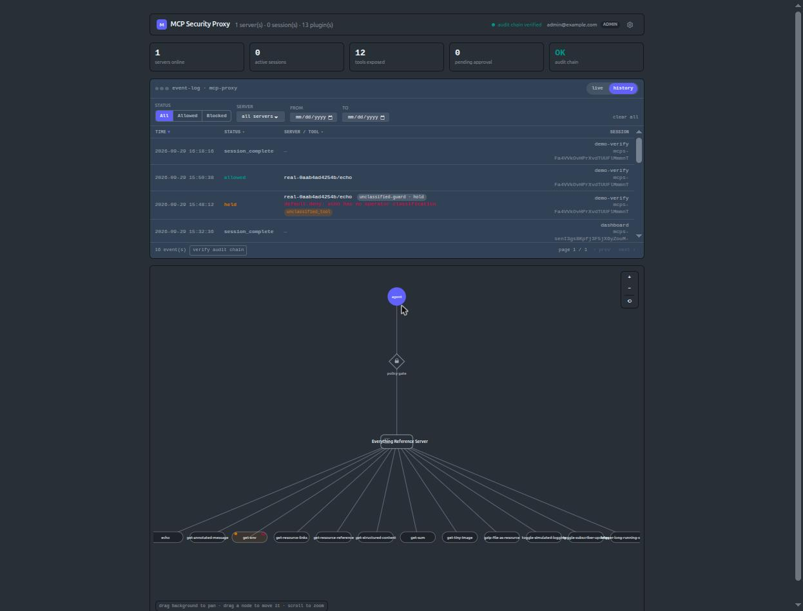

# MCP Security Proxy

A policy-enforcing proxy between an AI agent (MCP client) and the MCP servers
it calls tools on. Every `tools/call` runs through a plugin pipeline — policy
decisions, content scanners, tamper-evident audit — before it is forwarded.
A LiveView dashboard visualizes traffic and lets an operator curate policy.



See [`Project.md`](Project.md) for an overview and [`docs/adr/`](docs/adr) for
the architecture and productionization decisions.

**Start here:** [product guide](docs/product-guide.md) — deploy, configure, and use it end to end.

**Docs:** [threat model](docs/threat-model.md) ·
[deployment guide](docs/deployment.md) · [operator runbook](docs/runbook.md) ·
[CI/CD](docs/ci-cd.md) · [observability](docs/observability.md) ·
[latency budget](docs/latency-budget.md) ·
[plugin supply chain](docs/plugin-supply-chain.md) ·
[injection detection](docs/injection-detection.md) ·
[plugin protocol](docs/plugin-protocol.md) ·
[productionization plan](docs/productionization-plan.md)

## Development

Needs a Postgres. The compose file has one:

```
docker compose up -d postgres    # or use a local Postgres on :5432
mix setup                        # install deps, create + migrate the DB, build assets
mix phx.server                   # http://localhost:4000 — dashboard at /mcp/dashboard
mix precommit                    # compile (warnings as errors) + format + test — the gate
```

Repo connection defaults to `postgres:postgres@localhost:5432`; override with
`PGHOST` / `PGPORT` / `PGUSER` / `PGPASSWORD` / `PGDATABASE`.

`mix ci` runs the full gate CI enforces (format check, warnings-as-errors,
`deps.audit`, tests, dialyzer). See [`docs/ci-cd.md`](docs/ci-cd.md) for the
pipelines, releases, and rollback.

## Deployment

Single-node Docker Compose (`app` + `postgres`):

```
cp .env.example .env              # non-secret config: PHX_HOST, ADMIN_EMAIL/PASSWORD, ports
mkdir -p secrets                  # the three real secrets are Docker secret files:
openssl rand -hex 64    > secrets/secret_key_base.txt
openssl rand -hex 32    > secrets/audit_checkpoint_key.txt
openssl rand -base64 24 > secrets/postgres_password.txt
docker compose up -d              # the app runs migrations on start
```

Every boot seeds an admin from `ADMIN_EMAIL` / `ADMIN_PASSWORD` if that email
doesn't already have an account; sign in at `/login`.

Full topology, sizing, TLS, retention, and backups: [`docs/deployment.md`](docs/deployment.md).
Day-to-day operation and incident response: [`docs/runbook.md`](docs/runbook.md).

Health: `/health/live` (liveness, used by the container healthcheck) and
`/health/ready` (Postgres + upstream reachability). Metrics: Prometheus text at
`/metrics`. Add the observability stack with
`docker compose -f docker-compose.yml -f compose.observability.yml up -d` — see
[`docs/observability.md`](docs/observability.md).

## Stack

Phoenix 1.8 · LiveView · Bandit · Ecto/Postgres. HTTP via `Req`.

## License

Apache License 2.0, subject to the Commons Clause License Condition v1.0.
You're free to view, fork, modify, and distribute this code for personal or
internal use — you just can't sell it or offer it as a paid product/service.
See [`LICENSE`](LICENSE) and [`NOTICE`](NOTICE) for the full terms.
